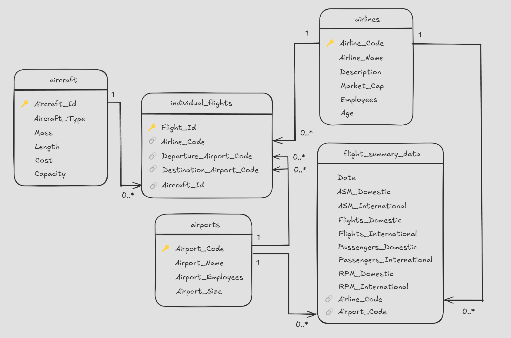
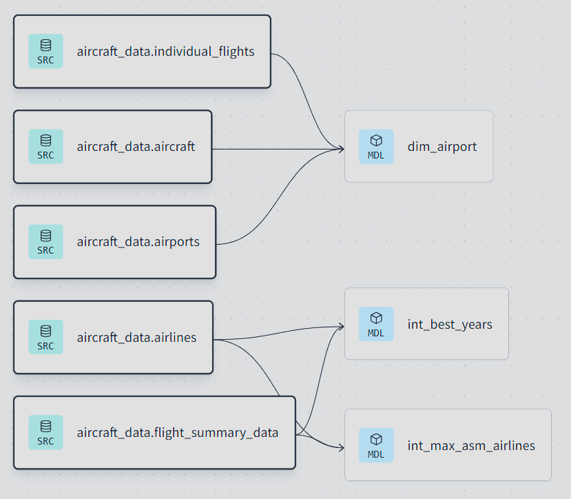

# ✈️ Analysing airline growth with SQL, Snowflake and DBT

This project models and analyses commercial airline data to investigate growth patterns, passenger volumes, and fleet activity. It uses a modern data stack: data is stored and queried in **Snowflake**, modelled using **dbt Core**, and analysed interactively in **Deepnote**.

It was developed as part of a professional data science certification at Jedha (RNCP35288).

This repository includes:
- A full dbt project (`/dbt_project`)
- A raw SQL data seed (`aircraft_db.sql`)
- A Deepnote notebook (`/deepnote_report`) and slides (`/slides`) for presenting results

---

## 📊 Dataset

This project uses a fictional dataset provided by Jedha for training purposes.

The data was loaded using the [`aircraft_db.sql`](./aircraft_db.sql) script and includes the following tables:

- `aircraft` – individual aircraft with type and capacity
- `airports` – airport codes and names
- `airlines` – airline codes and names
- `individual_flights` – flight-level records including aircraft ID and airport codes
- `flight_summary_data` – aggregated airline metrics

> This dataset has been synthetically generated and does not represent real airline operations.

---

## 📌 Objectives

- Structure raw aviation data into clean, queryable models using dbt
- Analyse aircraft activity, airport passenger volume, and airline growth
- Apply modular, testable analytics engineering principles
- Communicate insights clearly to stakeholders using notebooks

---

## 🧰 Tools & technologies

- **Snowflake** – cloud data warehouse (data storage and compute)
- **dbt Core** – SQL modelling (sources, staging, dimensions, marts)
- **SQL** – data transformation, aggregation, business logic
- **Jinja** – templating logic for dbt model automation
- **Deepnote** – collaborative notebook for SQL analysis and presentation
- **Git / GitHub** – version control and documentation

---

## 🔄 Project workflow

### ❄️ 1. Data loading into Snowflake

- Loaded raw aviation data into Snowflake using the script [`aircraft_db.sql`](./aircraft_db.sql)
- Created a small virtual warehouse and a dedicated database/schema via the Snowflake web UI
- Executed DDL and `INSERT` statements to populate the following tables:
  - `aircraft`
  - `airports`
  - `airlines`
  - `individual_flights`
  - `flight_summary_data`

> These tables were the starting point for dbt transformations.

### 🧱 2. DBT modelling phase

- Created **sources** for the 4 raw tables in Snowflake using `sources.yml`
- Built **staging models** to standardise formats (e.g. dates, names, types)
- Designed dimensional models: `dim_aircraft`, `dim_airport`, and a placeholder `dim_airline` (included for completeness, not run due to Snowflake trial expiration)
- Developed **intermediate models** to answer business questions:
  - `int_max_asm_airlines` – ASM-based airline growth
  - `int_best_years` – Revenue Passenger Miles per airline/year
- Applied **Jinja templating** (e.g. `ref()`, `source()`) to define model relationships and structure modular SQL logic

> *These dbt models served as the analytical foundation for further exploration in Deepnote.*

### 📊 3. Interactive analysis in Deepnote

- Connected Deepnote directly to Snowflake
- Re-ran and refined queries for readability and presentation
- Built visual summaries and business recommendations

---

## ❓ Business questions answered

1. **Which aircraft flew the most?**  
   → The Goose, with 1,008 flights

2. **Which airport transported the most passengers?**  
   → The Amazon Mothership (estimated via capacity × flight count)

3. **What was the best year for RPM (Revenue Passenger Miles) per airline?**  
   → Varied by airline (2015–2016); nulls handled as zeroes

4. **What was the best year for growth based on ASM (Available Seat Miles)?**  
   → Goose Airways peaked in 2016 with the highest average ASM

---

## 💡 Key insights

- **Amazon Airlines** leads in volume but faces competition from **Flock Air** and **Goose Airways**.
- 2016 marked the peak growth year across several carriers.
- Suggested strategies include **fleet modernisation**, **loyalty programmes**, and **airport partnerships**.

---

## 🧠 What I learned

- How to structure and document a complete dbt project
- How to use `Jinja`, tests, and modular SQL for transformation layers
- How to connect BI tools like Deepnote to a cloud data warehouse
- How to adapt technical queries for clear stakeholder-facing insights

---

## 📁 Repo structure

Analysing_Airline_Growth_with_SQL_Snowflake_and_DBT/ 
├── aircraft_db.sql                # ❗ Raw data loading script (DDL + inserts) 
├── dbt_project/ 
│   ├── models/ 
│   │   ├── staging/ 
│   │   ├── aircraft/ 
│   │   │   ├── dim_aircraft.sql 
│   │   │   ├── dim_airline.sql 
│   │   │   ├── dim_airport.sql 
│   │   │   ├── int_max_asm_airlines.sql 
│   │   │   └── int_best_years.sql 
│   ├── dbt_project.yml 
│   ├── schema.yml 
│   ├── sources.yml 
│   └── README.md 
├── deepnote_report/ 
│   └── final_analysis_notebook.pdf 
├── slides/ 
│   └── airline_growth_slides.pptx 
├── screenshots/ 
│   └── dbt_graph.png 
└── README.md 

---

## 📎 Notes

This project was completed independently using modern analytics engineering practices. The DBT portion was prototyped and tested before delivering the final analysis through Deepnote, for clarity and communication with non-technical stakeholders.
⚠️ Due to the expiration of the Snowflake free trial, the final dbt build and documentation steps could not be executed. Models like `dim_airline` are included to demonstrate the intended structure and modelling approach.